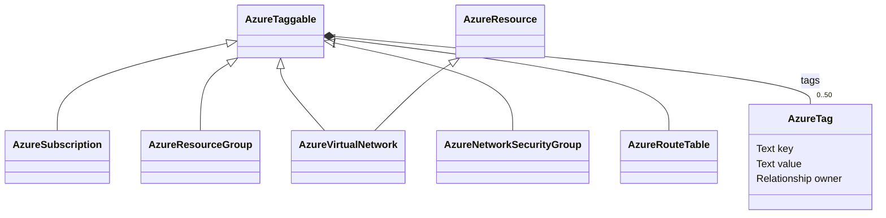

# infrahub-provisioner

Configure Infrahub through code to provide a source of infrastructure intent for
Infrastructure as Code (IaC). Start with basic IP address management (IPAM), then
extend toward Azure and external Terraform/OpenTofu consumers.

## Current status

The repository provides unmodified upstream base, VRF, and Azure schemas, a locked Python
environment, a local Azure management-group extension, an SDK-based schema check,
read-only verification of the deployed models and Azure hierarchy, and a
create-only seed workflows for Azure intent and cloud locations. Infrahub `main`
contains the `fake-corp` tenant, 13 management groups, 12 subscriptions with Azure
GUIDs pending, the 57-region reference catalog, and the planned Connectivity
resource group `rg-conn-prd-network`, and its planned hub VNet `vnet-conn-prd-hub`
using `10.150.0.0/24` in the default IP namespace, with six planned subnets
and two DNS resolver delegations.

The upstream base and VRF schemas are deployed on the lab’s `main` branch after
validation and merge of `upstream-ipam`. No sample or operational objects were loaded during schema setup.

The lab runs Infrahub `1.10.6`. This workflow uses SDK `1.22.1`, selected from the
documented compatible `1.22.x` series and tested against the lab with Python 3.14.
Recheck compatibility before upgrading either dependency or server.

## First milestone: IPAM schemas

The first implementation milestone is **schemas only**, covering:

- IP namespaces for isolated addressing, including overlapping address space.
- Prefixes and subnets, with subnets represented as prefixes.
- IPv4 and IPv6 addresses using Infrahub's native IPAM hierarchy.
- VRFs as routing contexts, distinct from addressing namespaces.

Use YAML with the official Python SDK and `infrahubctl`, reusing compatible models
from the OpsMill Schema Library. Pin dependencies and upstream schema revisions,
and validate schema changes on a dedicated Infrahub branch before integration.

The schemas-only milestone is complete. The seed workflow adds the reference
catalog described below; it creates no operational allocations.
Automatic allocation remains deferred. The later Azure schema step adds model
relationships to IPAM prefixes, without creating resource objects.

The unchanged upstream dependency set also supplies DCIM, organization, location
generics, and route-target schemas. These are loaded as dependencies, without
populating their objects. Upstream menu settings are preserved, including hidden
standalone prefix/address menu entries.

### Progress

- [x] Initialize the GitHub repository and project guidance.
- [x] Verify lab login and GraphQL access.
- [x] Document scope and the first milestone.
- [x] Inspect the live schema and select compatible SDK/library versions.
- [x] Establish reproducible local tooling and provisioning commands.
- [x] Vendor unmodified upstream base, VRF, and Azure schemas with required dependencies.
- [x] Validate schema loading and repeatability on a dedicated Infrahub branch.
- [x] Integrate the validated schemas and document the working workflow.

## Lab access

The existing lab instance is at <http://ihub01:8000>. These default credentials are
intentionally documented with the lab owner's authorization:

```sh
export INFRAHUB_ADDRESS='http://ihub01:8000'
export INFRAHUB_USERNAME='admin'
export INFRAHUB_PASSWORD='infrahub'
```

Set these variables in the shell where you run the commands below. No persistent
API token is needed for this username/password workflow.

For future automation, the SDK supports `INFRAHUB_API_TOKEN`. Keep generated tokens
outside tracked files and logs. See [AGENTS.md](AGENTS.md) for authentication,
branch selection, API endpoints, and contributor instructions.

## Setup and schema workflow

Install [uv](https://docs.astral.sh/uv/getting-started/installation/), clone this
repository, and run commands from its root. Python 3.12–3.14 is supported by the
project; `.python-version` selects 3.14 and uv can provision it if needed.

```sh
uv sync --locked
```

The load uses the checked-in YAML; it does not download changing upstream schemas.
The [provenance notes](third_party/schema-library/README.md) record the upstream
revision, license, and file hashes. The full upstream base includes DCIM, location,
and organization dependencies; the VRF extension includes route targets. Load the
whole `schemas` directory together so VRF extensions can
resolve the prefix and address models.

For the initial bootstrap, create a dedicated **Infrahub branch** (separate from
Git branches), check the proposed changes, then load and verify:

```sh
uv run infrahubctl branch create upstream-ipam
uv run python scripts/check_schema.py --branch upstream-ipam
uv run infrahubctl schema load schemas --branch upstream-ipam --wait 30
uv run python scripts/verify_schema.py --branch upstream-ipam
```

Inspect the check output before loading. The schema includes prefixes, addresses,
VRFs, route targets, and required base models; it reuses the built-in
`IpamNamespace`. All six YAML files are byte-for-byte upstream copies.
Use a new branch name for subsequent changes. Branch creation itself is not
idempotent; skip it if intentionally resuming an existing open validation branch.

Verify repeatability by rerunning the load and check:

```sh
uv run infrahubctl schema load schemas --branch upstream-ipam --wait 30
uv run python scripts/check_schema.py --branch upstream-ipam
```

An unchanged load reports that the schema is already up to date. The check should
show empty `added`, `changed`, and `removed` sections. After successful validation,
integrate and verify the destination:

```sh
INFRAHUB_TIMEOUT=180 uv run infrahubctl branch merge upstream-ipam
uv run python scripts/check_schema.py --branch main
uv run python scripts/verify_schema.py --branch main
```

The merge uses a longer request timeout because integration can take more than a
minute in this lab. If a request times out or says the branch is being merged,
inspect branch status and verify `main` before retrying.

The check and verification scripts require an explicit branch and return a nonzero
exit code on failure. Use `scripts/check_schema.py` for automated gates: the pinned
`infrahubctl schema check` can print server validation errors while returning exit
code zero. Schema loading still uses the official CLI. A failed load or worker
convergence timeout requires inspection of the target branch before retrying;
it does not imply that the server rolled back the load.

## Model behavior and validation

`IpamPrefix` and `IpamIPAddress` inherit Infrahub's native IPAM generics and use
namespace-scoped uniqueness. Both have status, description, and optional role
fields; addresses also have an optional FQDN. Subnets use `IpamPrefix`.

`IpamVRF` has a globally unique name, optional route distinguisher, and description.
Prefixes and addresses can optionally reference one VRF. VRFs do not create or
select namespaces, and do not independently permit duplicate addresses in a
namespace. Use separate namespaces for overlapping address space. Upstream route-target
import/export relationships and the `enforce_unique` field are retained. That field
records intent only: upstream does not enforce VRF-level uniqueness.

Validation performed against `upstream-ipam` and the merged `main` includes schema acceptance, native
inheritance, namespace-scoped uniqueness constraints, optional VRF relationships,
GraphQL availability, and an unchanged reload. Schema setup created no data.
The seed milestone separately verifies the reference catalog and ULA hierarchy.

The project CLI scripts use Typer and preserve the options shown above. Tests use
pytest and Typer’s CliRunner with mocked SDK calls; the default suite is offline.

Local regression tests also cover seed preview/apply options, creation order,
conflicts, partial failures, reruns, SDK value normalization, and catalog validity.
They cover rejected server checks, empty schema directories,
invalid YAML shape, and the integrity of vendored upstream files. Live negative
checks confirmed failure for missing models,
invalid credentials, and an unknown schema dependency.

```sh
uv run pytest
uv run ruff check scripts tests
uv run ruff format --check scripts tests
```

## IPAM reference seed data

Migrated on Infrahub `main` after validation and merge of `ipam-default`; the empty
`global` namespace has been deleted. All 19 original prefix IDs and catalog fields
were preserved, including the native `fc00::/7` → `fd00::/8` hierarchy.

`data/ipam.yaml` defines 19 reference prefixes in the existing `default`
namespace. This makes the catalog visible in [IPAM → IP Prefixes](http://ihub01:8000/ipam?branch=main)
without selecting a different namespace. Prefix descriptions include purpose and
RFC links. No individual addresses, VRFs, or allocation pools are seeded.

The catalog uses a name-only namespace selector. The seed requires that namespace
to exist and preserves its description and default designation. It does not
create or modify namespace metadata in this mode. Custom catalogs may include a
namespace description to create a missing non-default namespace; reruns check its
metadata for conflicts. The built-in `default` namespace must always already exist.

| Purpose | Prefixes |
| --- | --- |
| IPv4 documentation | `192.0.2.0/24`, `198.51.100.0/24`, `203.0.113.0/24` |
| IPv6 documentation | `2001:db8::/32`, `3fff::/20` |
| RFC1918 | `10.0.0.0/8`, `172.16.0.0/12`, `192.168.0.0/16` |
| ULA aggregate / locally assigned | `fc00::/7`, `fd00::/8` |
| CGNAT shared space | `100.64.0.0/10` |
| Link-local | `169.254.0.0/16`, `fe80::/10` |
| Loopback | `127.0.0.0/8`, `::1/128` |
| Benchmarking | `198.18.0.0/15`, `2001:2::/48` |
| IPv4/IPv6 translation | `64:ff9b::/96`, `64:ff9b:1::/48` |

These are `IpamPrefix` records with `status=reserved`, no role/VRF, and
`is_pool=false`. Reserved is a catalog status, not IANA's reserved-by-protocol
classification. Aggregates contain prefixes; the single-address `::1/128` uses
`member_type=address`. Infrahub derives the `fc00::/7` → `fd00::/8` hierarchy.
For operational ULA use, generate a pseudorandom 40-bit Global ID for a `/48`
within `fd00::/8` and use `/64` subnets. This seed does not generate allocations.

After setting the lab environment variables above, preview without writes:

```sh
uv run python scripts/seed_ipam.py --branch main
```

An apply creates only missing catalog prefixes. On a bare compatible instance,
the built-in default namespace is reused and 19 prefixes are created. Unchanged
reruns match all 20 objects (namespace plus prefixes). Use a dedicated Infrahub
branch when applying catalog changes; the seed never creates or merges branches.

`--data PATH` selects another catalog with the same format. The CLI validates all
input and checks all existing seed-field conflicts before writing. Differences
are reported without overwriting or deleting objects. It ignores unrelated objects
and optional non-seed relationships. It exits nonzero on conflicts or API failures.
If a write fails midway, inspect the branch and rerun: successfully created objects
are retained and matched on the next run. Creation does not use upsert.

The source catalog uses the [IANA IPv4 registry](https://www.iana.org/assignments/iana-ipv4-special-registry),
[IANA IPv6 registry](https://www.iana.org/assignments/iana-ipv6-special-registry),
and [RFC4193](https://www.rfc-editor.org/rfc/rfc4193).

### Migration from global to default

The original `ipam-seed` integration placed the catalog in `global`. The dedicated
`scripts/move_ipam_to_default.py` command migrates that catalog into the existing
`default` namespace and deletes `global` only after verifying that it is empty.
The normal seed command does not perform moves or deletions.

Migration preflight requires exactly the catalog across the two namespaces, no
duplicate or extra prefixes, no individual addresses or unexpected prefix types,
and no catalog-field conflicts. It changes only each prefix's namespace, preserves
object IDs, and checks that native containment has reconciled at the destination.
Both generic prefix/address inventories are rechecked before source deletion,
because namespace deletion cascades to contained IP resources. Run one writer on
the migration branch; do not add data concurrently.

The command defaults to preview. After interruption, inspect the branch and rerun;
previously moved prefixes are recognized and no rollback is attempted. It also
supports an unchanged rerun after `global` has been deleted. A failed destination
or emptiness check prevents source deletion.


Verified migration-branch commands:

```sh
uv run infrahubctl branch create ipam-default
uv run python scripts/move_ipam_to_default.py --branch ipam-default
uv run python scripts/move_ipam_to_default.py --branch ipam-default --apply
uv run python scripts/move_ipam_to_default.py --branch ipam-default --apply
uv run python scripts/seed_ipam.py --branch ipam-default --apply
uv run python scripts/seed_ipam.py --branch ipam-default
uv run python scripts/verify_schema.py --branch ipam-default
uv run python scripts/check_azure_hierarchy.py --branch ipam-default
uv run python scripts/seed_azure_hierarchy.py --branch ipam-default
```

The first migration moved all 19 prefixes with unchanged IDs and native hierarchy,
then deleted the empty source. The second moved zero. Both seed checks matched
their catalogs: 20 IPAM objects and 14 Azure objects. Only the original default
IP namespace remains, with its original default designation.


The merge and destination checks were verified with:

```sh
INFRAHUB_TIMEOUT=180 uv run infrahubctl branch merge ipam-default
uv run python scripts/seed_ipam.py --branch main
uv run python scripts/verify_schema.py --branch main
uv run python scripts/check_azure_hierarchy.py --branch main
uv run python scripts/seed_azure_hierarchy.py --branch main
```

The main-branch prefix IDs were compared with a pre-migration snapshot: all 19
were preserved, and every prefix now belongs to the original default namespace.
Both catalog previews report no missing or conflicting objects. Existing browser
links selecting the deleted global namespace should be replaced with
[the default IPAM view](http://ihub01:8000/ipam?branch=main).

## Azure schema

Deployed to Infrahub `main` after validation and merge of `azure-schema`.
The schema-only integration created no Azure data. The planned `fake-corp` seed
workflow is described below; the existing IPAM reference data is preserved.

The unchanged experimental Azure extension is vendored at the same upstream
revision as the base and VRF schemas. It adds these models:

| Kind | Purpose |
| --- | --- |
| `AzureTenant` | Tenant name/ID and subscriptions |
| `AzureSubscription` | Subscription name/ID, tenant, and resource groups |
| `AzureLocation` | Upstream region model; replaced locally by `AzureRegion` (see below) |
| `AzureResourceGroup` | Resource group, subscription, and location |
| `AzureVirtualNetwork` | VNet, location/resource group, address space, and subnets |
| `AzureVirtualNetworkSubnet` | Subnet, parent VNet, and IPAM prefixes |
| `AzureResource` | Shared resource generic inherited by VNets |

VNet address space and subnet prefixes reference `BuiltinIPPrefix`, which includes
our `IpamPrefix` records. This step creates no Azure objects or operational IP
allocations and requires no Azure credentials. The extension is experimental and
is not a complete Azure deployment model: VMs, NICs, and other
resource types are not included.

Use the existing environment and commands to validate the complete schema set:

```sh
uv run infrahubctl branch create azure-schema
uv run python scripts/check_schema.py --branch azure-schema
uv run infrahubctl schema load schemas --branch azure-schema --wait 30
uv run python scripts/verify_schema.py --branch azure-schema
uv run infrahubctl schema load schemas --branch azure-schema --wait 30
uv run python scripts/check_schema.py --branch azure-schema
uv run python scripts/seed_ipam.py --branch azure-schema
```

The second load should make no changes, the check should show no diff, and the
seed preview should report all 20 catalog objects matching. The verifier now
requires both IPAM and Azure models and queries every supported Azure node type.
After validation, merge and inspect the destination:

```sh
INFRAHUB_TIMEOUT=180 uv run infrahubctl branch merge azure-schema
uv run python scripts/verify_schema.py --branch main
uv run python scripts/check_schema.py --branch main
uv run python scripts/seed_ipam.py --branch main
```

Choose a new branch name for later changes; no schema/seed command implicitly
creates or merges branches. Vendored schema files remain byte-for-byte upstream copies.

## Azure management groups

Deployed to Infrahub `main` on 2026-09-09 after validation and merge of
`azure-management-groups`. The initial schema-only integration had empty Azure inventories.

The repository-owned extension lives in
[schemas/local/azure_management_groups.yml](schemas/local/azure_management_groups.yml).
Both schema checking and loading discover YAML recursively. Files listed in the
upstream manifest remain unchanged; local additions are maintained separately.

`AzureManagementGroup` has an optional `management_group_id`, required `display_name`,
optional `description`, and required `tenant`. Populated group IDs are unique within
their tenant; the CLI requires an ID for every non-root group.
Use Infrahub object IDs or tenant plus management-group ID to identify records.
There is no HFID because the upstream tenant ID has no uniqueness constraint.
The group appears under Azure without inheriting resource-group-scoped `AzureResource`.

`AzureManagementGroupHierarchy` supplies native parent/children hierarchy and uses
the UI label **Management Group Hierarchy**. Its model identifier and
`/objects/AzureManagementGroupHierarchy` route remain unchanged. A group
without a parent is a root; no root flag is stored. Local extensions add
`AzureTenant.management_groups`, `AzureSubscription.management_group`, and the
reverse group `subscriptions` relationship. The original subscription tenant
relationship remains required. Group membership is optional for incremental editing.

The hierarchy label was validated on `azure-hierarchy-label`. Its merge left the
old generic label on `main`; the remaining label-only diff was applied with
`uv run infrahubctl schema load schemas --branch main --wait 30`. A subsequent
`uv run python scripts/check_schema.py --branch main` reported no diff or warnings,
and the live label and unchanged object counts were verified.

Run the read-only complete-hierarchy gate with an explicit branch:

```sh
uv run python scripts/check_azure_hierarchy.py --branch main
```

It reads all tenants, groups, and subscriptions using SDK pagination and reports
all findings with identifiers. Each modeled tenant must have exactly one root
whose group ID matches its tenant ID when both are populated. Groups must reach that root without cycles,
self-parenting, missing parents, or crossing tenants. At most six group levels may
sit beneath the root; subscriptions do not count toward depth. Every subscription
must belong to a group in its own tenant. Duplicate tenant IDs and group IDs within
a tenant are rejected case-insensitively, and root ID comparison is case-insensitive.

Local extensions make tenant and subscription Azure GUIDs optional, and display
these objects by name. The tenant root may also have an unset group ID. Missing
GUIDs are reported as pending information and do not fail a valid planned tree;
missing non-root group IDs remain errors. Populated tenant, subscription, and root
IDs must be GUIDs in the usual hyphenated form. Absent IDs do not count as
duplicates. Infrahub object IDs remain separate from Azure identifiers.

Group identifiers must follow [Microsoft's naming rules](https://learn.microsoft.com/en-us/azure/azure-resource-manager/management/resource-name-rules#microsoftmanagement):
1–90 characters from ASCII letters, digits, hyphens, underscores, periods, and
parentheses; start with a letter or digit and do not end with a period.
See also [Microsoft's hierarchy limits](https://learn.microsoft.com/en-us/azure/azure-resource-manager/management/azure-subscription-service-limits)
and [root group behavior](https://learn.microsoft.com/en-us/azure/governance/management-groups/overview).

Exit status is `0` for valid data (explicitly including an empty Azure inventory),
and `1` for invalid data or read failures. These complete-hierarchy checks are CLI
gates, not automatic enforcement on UI/API writes. Run them before consuming or
integrating operational Azure intent. Schema constraints alone do not guarantee a
complete valid Azure tree or case-insensitive identifier uniqueness.

The following integration workflow was verified on `azure-management-groups`:

```sh
uv run infrahubctl branch create azure-management-groups
uv run python scripts/check_schema.py --branch azure-management-groups
uv run infrahubctl schema load schemas --branch azure-management-groups --wait 30
uv run python scripts/verify_schema.py --branch azure-management-groups
uv run python scripts/check_azure_hierarchy.py --branch azure-management-groups
uv run infrahubctl schema load schemas --branch azure-management-groups --wait 30
uv run python scripts/check_schema.py --branch azure-management-groups
uv run python scripts/seed_ipam.py --branch azure-management-groups
```

Loading succeeded; the unchanged reload required no changes, the schema check had
no diff or warnings, hierarchy validation passed explicitly as empty, and the IPAM
preview matched all 20 catalog objects. Hierarchy scenarios use offline fixtures;
no live tenant, management group, or subscription data was created during that
schema-only integration. The seed workflow below now creates explicitly requested
planned intent. Synchronization, Azure execution, and policy/RBAC remain deferred.

The branch was merged and the destination verified with:

```sh
INFRAHUB_TIMEOUT=180 uv run infrahubctl branch merge azure-management-groups
uv run python scripts/verify_schema.py --branch main
uv run python scripts/check_azure_hierarchy.py --branch main
uv run python scripts/check_schema.py --branch main
uv run python scripts/seed_ipam.py --branch main
```

`main` passed schema and empty-hierarchy verification with no schema diff or
warnings. The IPAM preview reported `missing=0, skipped=20, conflicting=0`.
Use a new validation branch for subsequent changes.

## Planned fake-corp seed

Deployed to Infrahub `main` after validation and merge of `fake-corp-hierarchy`.

[data/azure_hierarchy.yaml](data/azure_hierarchy.yaml) defines one tenant named
`fake-corp` and the 13 management groups from
[Microsoft's landing-zone diagram](https://learn.microsoft.com/en-us/azure/cloud-adoption-framework/ready/landing-zone/media/azure-landing-zone-hierarchy.svg).
The tenant/root Azure GUIDs start unset. Child IDs have no organization prefix:

```text
Tenant root group (Azure ID pending)
└── fake-corp
    ├── platform
    │   ├── security
    │   ├── management
    │   ├── connectivity
    │   └── identity
    ├── landing-zones
    │   ├── online
    │   ├── corp
    │   └── local
    ├── sandbox
    └── decommissioned
```

The catalog contains `tenant: {name: ...}`, `root: {display_name: ...}`, a
`management_groups` list, and an optional `subscriptions` list. Each list entry contains `management_group_id`,
`display_name`, and `parent`; `parent: null` references the separately declared
tenant root. Other parents reference group IDs case-insensitively. YAML order is
irrelevant; the command sorts groups into dependency order and creates subscriptions
after their tenant and groups. GUIDs and descriptions are not accepted seed fields.
Catalogs without a subscriptions section remain supported.

The command matches tenants by name, groups by tenant plus case-insensitive group
ID, and the root by tenant plus absence of a parent. Ambiguous matches fail before
writes. Tenant names are stable catalog identity keys; changing one means selecting
a different tenant, not renaming the existing tenant. Group display-name and parent
edits are conflicts, never overwritten. Existing tenant-name casing differences
also require resolution. An ID casing difference alone does not create a duplicate.

The preflight validates both the catalog and the entire projected branch hierarchy,
including unmanaged groups and subscriptions. Existing invalid data can therefore
block a seed. All conflicts are reported before writes. Apply creates only missing
objects and never updates, moves, or deletes existing objects. Descriptions and
other unmanaged fields are preserved. Partial writes are not rolled back: inspect
and rerun after a failure. Exit status is `0` on success and `1` on invalid input,
conflicts, or read/write failures. Run one seed writer per branch at a time.

Populate tenant/subscription GUIDs and the root group GUID later in Infrahub through
a manual update or a future synchronization workflow. The seed omits those fields
and preserves them on reruns; setting a tenant GUID does not automatically set the
root GUID. No command in this workflow contacts Azure or creates Azure resources.
Automatic GUID synchronization and Azure deployment execution remain deferred.


The following commands were verified on the Infrahub validation branch:

```sh
uv run infrahubctl branch create fake-corp-hierarchy
uv run python scripts/check_schema.py --branch fake-corp-hierarchy
uv run infrahubctl schema load schemas --branch fake-corp-hierarchy --wait 30
uv run python scripts/verify_schema.py --branch fake-corp-hierarchy
uv run python scripts/seed_azure_hierarchy.py --branch fake-corp-hierarchy
uv run python scripts/seed_azure_hierarchy.py --branch fake-corp-hierarchy --apply
uv run python scripts/seed_azure_hierarchy.py --branch fake-corp-hierarchy --apply
uv run python scripts/check_azure_hierarchy.py --branch fake-corp-hierarchy
uv run infrahubctl schema load schemas --branch fake-corp-hierarchy --wait 30
uv run python scripts/check_schema.py --branch fake-corp-hierarchy
uv run python scripts/seed_ipam.py --branch fake-corp-hierarchy
```

The preview reported 14 missing objects; the first apply created all 14, and the
second reported `created=0, skipped=14, conflicting=0`. The stored hierarchy passed
with one tenant, 13 groups, zero subscriptions, and two pending Azure identifiers.
The schema reload required no changes and the subsequent schema check had no diff
or warnings. The IPAM preview matched all 20 catalog objects.


The merge and destination checks were verified with:

```sh
INFRAHUB_TIMEOUT=180 uv run infrahubctl branch merge fake-corp-hierarchy
uv run python scripts/verify_schema.py --branch main
uv run python scripts/check_azure_hierarchy.py --branch main
uv run python scripts/seed_azure_hierarchy.py --branch main
uv run python scripts/check_schema.py --branch main
uv run python scripts/seed_ipam.py --branch main
```

`main` passed schema and planned-hierarchy validation. The Azure seed preview
reported `missing=0, skipped=14, conflicting=0`; the IPAM preview reported
`missing=0, skipped=20, conflicting=0`. Use a fresh validation branch for later
schema/catalog changes. The seed command defaults to preview; `--apply` creates
missing objects and `--data PATH` selects another catalog with the same format.

## Landing-zone subscription seed

The hierarchy catalog now includes these 12 subscriptions under `fake-corp`:

| Management group | Subscription names | Initial status |
| --- | --- | --- |
| Security | Security | Planned |
| Management | Management | Planned |
| Connectivity | Connectivity | Planned |
| Identity | Identity | Planned |
| Corp | Landing zone A1; Landing zone A2; Landing zone P1 | Planned |
| Local | Landing zone LC1 (Azure Local Clusters); Landing zone LA1 (Applications) | Planned |
| Sandbox | Sandbox 1; Sandbox 2 | Planned |
| Decommissioned | Decommissioned | Deprecated |

Online remains empty, matching the diagram. Each subscription entry contains
`name`, `management_group` (the existing group ID), and `status`. Subscription GUIDs
remain unset; none are invented. This adds data using the existing schema.

Subscription identity is tenant plus case-insensitive name. Duplicate catalog names,
ambiguous existing matches, exact-name differences, and membership conflicts block
all writes. Identical names in different tenants are allowed. Status is used only
on creation; reruns preserve GUIDs, status edits, and other operational fields.
Changing a catalog name selects a different identity; this is not a rename workflow.
The complete projected hierarchy is validated before writes, including subscriptions.

Verified subscription workflow:

```sh
uv run infrahubctl branch create azure-subscriptions
uv run python scripts/check_schema.py --branch azure-subscriptions
uv run python scripts/seed_azure_hierarchy.py --branch azure-subscriptions
uv run python scripts/seed_azure_hierarchy.py --branch azure-subscriptions --apply
uv run python scripts/seed_azure_hierarchy.py --branch azure-subscriptions --apply
uv run python scripts/check_azure_hierarchy.py --branch azure-subscriptions
uv run python scripts/verify_schema.py --branch azure-subscriptions
uv run python scripts/seed_cloud_locations.py --branch azure-subscriptions
uv run python scripts/seed_ipam.py --branch azure-subscriptions
```

The schema diff was empty. First apply created 12 subscriptions and matched the
existing 14 hierarchy objects; the rerun created zero and matched all 26. Hierarchy
validation reports 14 pending identifiers (tenant, root group, and 12 subscription
GUIDs). All 218 offline tests and Ruff checks passed, including paginated subscription
reads, late preflight conflicts, partial-write recovery, and operational edit preservation.

Merged with `INFRAHUB_TIMEOUT=180 uv run infrahubctl branch merge azure-subscriptions`.
On `main`, the schema and hierarchy verifiers and all three seed previews passed.
All 12 subscription names, memberships, initial statuses, and empty GUIDs were
verified; tenant, management-group, region, location-group, namespace, and prefix
IDs were preserved. Earlier 14-object counts above describe the original group-only
seed milestone; the current hierarchy catalog manages 26 objects.

## Azure lifecycle status

`schemas/local/azure_status.yml` adds a Status dropdown to tenants, management
groups, subscriptions, resource groups, regions, virtual networks, and virtual
network subnets. It is also available on the management-group hierarchy view.

| Option | Meaning |
| --- | --- |
| Planned | Intended configuration awaiting provisioning; default for most Azure objects |
| Active | Provisioned and in use |
| Reserved | Held for future use |
| Deprecated | Being retired or no longer recommended |
| Unmanaged | Azure-managed reference configuration; default for regions (`AzureRegion`) |

The choices are shared through local YAML definitions, not a global status registry.
Upstream IPAM dropdowns remain Active, Reserved, and Deprecated. Infrahub normalizes
attributes with defaults to optional inputs; omitted status receives the default.
Status remains editable, including on regions, and seed reruns preserve edits.
No discovery, Azure provisioning, or automatic lifecycle transitions are performed.

Validated on the `azure-status` Infrahub branch using:

```sh
uv run python scripts/check_schema.py --branch azure-status
uv run infrahubctl schema load schemas --branch azure-status --wait 30
uv run python scripts/verify_schema.py --branch azure-status
uv run infrahubctl schema load schemas --branch azure-status --wait 30
uv run python scripts/check_azure_hierarchy.py --branch azure-status
uv run python scripts/seed_azure_hierarchy.py --branch azure-status
uv run python scripts/seed_ipam.py --branch azure-status
```

The existing tenant and 13 management groups received Planned. No regions or other
Azure objects were created. The unchanged reload required no changes, the hierarchy
passed, and both catalogs matched (14 Azure objects and 20 IPAM objects).

Merged with `INFRAHUB_TIMEOUT=180 uv run infrahubctl branch merge azure-status`.
The same schema, hierarchy, and catalog checks passed against `--branch main`;
the schema diff was empty. Status values and original Azure object IDs were also
verified on `main`. Local validation: 176 pytest tests and Ruff checks passed.

## Cloud locations and Azure regions

The local `cloud_locations.yml` extension replaces the empty upstream
`AzureLocation` with `AzureRegion` and adds `LocationGroup`. Both inherit the native
`LocationGeneric` hierarchy. The same region record appears in the Location tree
and Azure **Regions** view; no duplicate geographic record is created.

```text
Cloud
├── Azure
│   ├── North America (12 regions)
│   ├── South America (3 regions)
│   ├── Europe (19 regions)
│   ├── Asia Pacific (17 regions)
│   ├── Middle East (4 regions)
│   └── Africa (2 regions)
└── AWS (empty)
```

`data/cloud_locations.yaml` contains nine groups and 57 current public-cloud
regions from [Microsoft's region list](https://learn.microsoft.com/en-us/azure/reliability/regions-list),
retrieved on 2026-09-09. Its source hash records the corresponding raw Markdown in
MicrosoftDocs/reliability-docs. Restricted-access regions are included; announced
future regions, sovereign clouds, nonregional values, region pairs, and availability
zones are excluded. Catalog presence does not imply subscription access or service
availability. This is a checked-in snapshot; seed runs do not fetch Azure or the web.

Broad groupings are repository navigation choices, recorded explicitly per region.
US, Canada, and Mexico are North America; Brazil and Chile are South America;
Australia and New Zealand are included in Asia Pacific; Israel, Qatar, and UAE are
Middle East. Country groups and AWS regions are not seeded.

Groups use globally unique internal names such as `cloud-azure-europe` and readable
labels such as **Europe**. Regions use Microsoft's programmatic name (`australiaeast`)
and readable `display_name` (**Australia East**). Regions default to **Unmanaged**;
seed reruns preserve status edits, descriptions, tags, and other unmanaged fields.

The API type and object route are now `AzureRegion` and `/objects/AzureRegion`.
`AzureLocation` is retired. Resource and resource-group relationship fields remain
`location`, now targeting `AzureRegion` and labeled **Region** in the UI. Vendored
YAML is unchanged; the local extension uses `state: absent` for the retired model.
The migration is only valid while the old model is empty: check its count before
loading into any deployment that still has it, and stop if records exist.

The seed command previews by default; `--apply` creates only missing records and
`--data PATH` selects a catalog with the agreed nine groups and region entries.
It reads all Location records with SDK pagination, preflights names, types, labels,
and parent relationships, then creates parents before children. Conflicts prevent
all writes. Exit codes are 0 for success and 1 for invalid input, conflicts, or API
failures. No objects are moved or deleted. Use one writer per branch; partial
failures require inspection and rerunning, without automatic rollback.

Verified branch workflow:

```sh
uv run infrahubctl branch create cloud-regions
uv run python scripts/check_schema.py --branch cloud-regions
uv run infrahubctl schema load schemas --branch cloud-regions --wait 30
uv run python scripts/verify_schema.py --branch cloud-regions
uv run python scripts/seed_cloud_locations.py --branch cloud-regions
uv run python scripts/seed_cloud_locations.py --branch cloud-regions --apply
uv run python scripts/seed_cloud_locations.py --branch cloud-regions --apply
uv run infrahubctl schema load schemas --branch cloud-regions --wait 30
uv run python scripts/check_schema.py --branch cloud-regions
uv run python scripts/check_azure_hierarchy.py --branch cloud-regions
uv run python scripts/seed_azure_hierarchy.py --branch cloud-regions
uv run python scripts/seed_ipam.py --branch cloud-regions
```

The rerun created zero records and matched all 66. Schema reload required no
changes. Native ancestor queries verified all 57 regions have Cloud, Azure, and
one geographic group as ancestors, with Unmanaged status; AWS has no children.
Existing Azure and IPAM catalogs matched. Offline validation passed 200 tests and
Ruff checks, including subtype-field reads through paginated SDK queries.

Integration command:

```sh
INFRAHUB_TIMEOUT=180 uv run infrahubctl branch merge cloud-regions
```

Deployed to Infrahub `main`. The schema verifier, empty schema diff, all three seed
previews, and management-group hierarchy validation passed there. Exact region
ancestors, readable names, Unmanaged statuses, and the empty AWS group were checked;
the original tenant, management-group, namespace, and prefix IDs were preserved.

## Azure key/value tags

`schemas/local/resource_tags.yml` adds `AzureTag` assignments owned by one
subscription, resource group, virtual network, NSG, or route table through the `AzureTaggable`
generic. The extension sorts after the other local Azure extensions so their
relationships and the added inheritance are composed together. Vendored schemas
remain unchanged. Azure Tags are available at `/objects/AzureTag`.



Each assignment has a required owner, key, and value, displayed as `key=value`.
Values are independent: a subscription could have `Environment=Production` and a
VNet `Environment=Test`; editing the VNet assignment affects only that VNet.
These are documentation examples, not seeded values. No tag values are created by
this change. Existing seed workflows preserve operational tag assignments.

Subscriptions and resource groups do not automatically propagate tags to children.
Tenants, management groups, regions, subnets, security rules, and routes do not
receive Azure tag support.
Regions and location groups retain their separate `BuiltinTag` label relationships;
those are Infrahub classification labels, not Azure key/value assignments. The
existing hierarchy, ownership, region, and IPAM relationships remain intact.

The schema declares one required owner, owner-plus-exact-key uniqueness, at most
50 assignments per owner, key length 1–512, value length at most 256, and prohibited
key characters `< > % & \ ? /`. Empty string values are permitted. Keys preserve
casing; values are case-sensitive. Case-insensitive duplicate keys are additionally
checked by `scripts/check_azure_tags.py --branch <branch>`, a read-only CLI gate.
It reads all owners and assignments with SDK pagination, checks ownership and all
naming/count limits, reports all findings, and returns 0 for valid/empty inventories
or 1 for invalid data/read failures. The CLI does not automatically run on UI/API
writes; use it before consuming intent for deployment.

The rules follow [Microsoft's Azure tag documentation](https://learn.microsoft.com/en-us/azure/azure-resource-manager/management/tag-resources).
No Azure synchronization, policy-based propagation, or deployment execution is
implemented. Adding other resource types requires checking their tag support and
any type-specific restrictions first.

Verified branch commands:

```sh
uv run infrahubctl branch create azure-tags
uv run python scripts/check_schema.py --branch azure-tags
uv run infrahubctl schema load schemas --branch azure-tags --wait 30
uv run python scripts/verify_schema.py --branch azure-tags
uv run python scripts/check_azure_tags.py --branch azure-tags
```

The branch schema exposes all three supported owner types, preserves built-in
location labels, and contains zero AzureTag records with 12 eligible owners.
Offline validation passed 249 tests and Ruff checks. Empty tag values and invalid
assignment scenarios were tested offline; no sample tags were written live.

An unchanged branch reload and schema check required no changes. All three seed
previews and the complete management-group hierarchy gate passed on `azure-tags`.
Merged using `INFRAHUB_TIMEOUT=180 uv run infrahubctl branch merge azure-tags`.
On `main`, schema verification, tag validation, the empty schema diff, and all
three seed previews passed. Existing tenant, group, subscription, region, location,
namespace, prefix, and built-in tag IDs were preserved; AzureTag remains empty.

```sh
uv run python scripts/check_azure_tags.py --branch main
```

## Resource-group seed tooling

Resource-group uniqueness is enforced in the schema using
`[subscription, name_key__value]`. `name_key` is a required, read-only computed Text
attribute containing the lowercase `name`. Names differing only by case therefore
share an identity within a subscription; region is not part of the constraint.
Different subscriptions can reuse a name. The original name and display label are
preserved. Normalized Name is a computed field, not a value operators must maintain.

The existing populated instance required a staged migration on
`resource-group-uniqueness`: add the computed field temporarily optional, then
change its Jinja expression from `{{ name__value | lower }}` to the equivalent
`{{ (name__value | lower) }}` to trigger recomputation for existing records. Once
all existing names are populated and checked for scoped collisions, make the field
required and reload. The committed schema is the final required form. Applying
that form directly to an older populated schema can fail the mandatory-field check;
do not bypass the check or populate a manually editable normalization field.

Validated the final required schema and unchanged reload on
`resource-group-uniqueness`, then merged it with
`INFRAHUB_TIMEOUT=180 uv run infrahubctl branch merge resource-group-uniqueness`.
On `main`, schema verification and an empty schema diff passed; the existing group
retained its ID and subscription and had the expected computed name. Resource-group
and IPAM previews reported no missing objects or conflicts. Offline tests cover
normalization and the scoped schema contract; no live duplicate test objects were
created. All 272 pytest tests and Ruff checks passed.

The resource-group model is labeled **Resource Groups** in the UI through a local
schema override. Its API type and route remain `AzureResourceGroup` and
`/objects/AzureResourceGroup`; each record still displays its own name.

`scripts/seed_azure_resource_groups.py` adds a create-only workflow for agreed
resource groups. Its YAML input has a `resource_groups` list; each entry contains
`name`, `tenant`, `subscription`, `region` (Azure programmatic identifier), and
initial `status`. Use `--branch <branch>` and `--data <catalog.yaml>` for preview;
add `--apply` to create missing groups. The default catalog path is
`data/azure_resource_groups.yaml`.

The command reads all dependencies and existing groups with SDK pagination.
Tenant/subscription names and region identifiers are matched case-insensitively;
all must resolve uniquely to existing objects. Resource-group identity is its
subscription plus case-insensitive name. Exact-name or region differences on a
matched group are conflicts. All conflicts prevent writes. Initial status is set
only on creation; operational status and tag edits are preserved on reruns.
No dependencies, tags, or network resources are created. Partial writes are not
rolled back; inspect and rerun after failure. Exit codes are 0 for success and 1
for invalid input, conflicts, or API failure.

The first requested group is `rg-conn-prd-network` in the `fake-corp` Connectivity
subscription, intended to hold network resources. The catalog selects Australia
East (`australiaeast`) and initial status Planned. Tool behavior has been tested
offline with Typer CliRunner, including conflicts and preservation on reruns.
The full suite passes 266 tests and Ruff checks.

Verified validation-branch commands:

```sh
uv run infrahubctl branch create connectivity-resource-group
uv run python scripts/seed_azure_resource_groups.py --branch connectivity-resource-group
uv run python scripts/seed_azure_resource_groups.py --branch connectivity-resource-group --apply
uv run python scripts/seed_azure_resource_groups.py --branch connectivity-resource-group --apply
uv run python scripts/verify_schema.py --branch connectivity-resource-group
uv run python scripts/check_azure_tags.py --branch connectivity-resource-group
```

First apply created one group; the second created zero and matched the existing
group. Live field reads verified its name, Connectivity membership, Australia East
region, and Planned status. No network resources or tags were created.

Merged using `INFRAHUB_TIMEOUT=180 uv run infrahubctl branch merge connectivity-resource-group`.
On `main`, the seed preview matched one group, schema and tag verification passed,
and field reads confirmed the original group ID and its fake-corp tenant membership.

## Virtual-network foundation

`schemas/local/virtual_networks.yml` strengthens the existing `AzureVirtualNetwork`
model without changing vendored schemas. Virtual Networks retain their API type,
route `/objects/AzureVirtualNetwork`, status choices (default Planned), tags, and
subnet relationships.

Every VNet requires a resource group, an independently selected Region, and at
least one IPAM prefix in `address_space`, including Planned records. Subscription
is reached through the resource group. Address space remains a many-valued
`BuiltinIPPrefix` relationship, supporting IPv4/IPv6 and namespace isolation;
no CIDR text field or new namespace is introduced.

Names follow [Microsoft's VNet naming rules](https://learn.microsoft.com/en-us/azure/azure-resource-manager/management/resource-name-rules):
2–64 ASCII letters/digits, underscores, periods, or hyphens; start with a letter or
digit and end with a letter, digit, or underscore. Required read-only `name_key`
computes lowercase from `name`, and `[resourcegroup, name_key__value]` enforces
case-insensitive uniqueness within each resource group. Names can be reused in
other resource groups; displayed names retain their case.

These are schema constraints enforced on writes. They do not establish deployment
readiness: overlap, subnet containment, and Azure-specific address-range checks
remain deferred, alongside DNS, peering, further subnet configuration, Azure identifiers,
allocation, seeding, and deployment. Existing IPAM catalog prefixes are unchanged;
this schema change creates no VNet, subnet, prefix, or tag records.

Validated on `azure-virtual-networks` with zero existing VNets. The schema check
passed without warnings, load and verification passed, and an unchanged reload
required no changes. Verified commands:

```sh
uv run python scripts/check_schema.py --branch azure-virtual-networks
uv run infrahubctl schema load schemas --branch azure-virtual-networks --wait 30
uv run python scripts/verify_schema.py --branch azure-virtual-networks
INFRAHUB_TIMEOUT=180 uv run infrahubctl branch merge azure-virtual-networks
uv run python scripts/check_schema.py --branch main
uv run python scripts/verify_schema.py --branch main
uv run python scripts/seed_azure_resource_groups.py --branch main
uv run python scripts/seed_ipam.py --branch main
```

After merge, `main` had an empty schema diff and passing schema verification.
Both seed previews found no missing objects or conflicts: one resource group and
the existing namespace plus 19 prefixes matched. VNets and subnets remain empty.
All 297 offline tests passed, including upstream hash verification, alongside Ruff
lint and formatting checks. Invalid-name and constraint scenarios used offline
fixtures; no live test objects were created.

## Connectivity hub VNet seed

`data/azure_hub_vnet.yaml` declares `vnet-conn-prd-hub` in fake-corp / Connectivity /
`rg-conn-prd-network`, in Australia East, initially Planned. Its address space is
`10.150.0.0/24` in the existing `default` IP namespace. The new prefix starts Reserved
(IPAM does not have a Planned choice), is not an allocation pool, and appears below
`10.0.0.0/8` in the native IPAM hierarchy. The original 19-prefix reference catalog
remains managed separately by `data/ipam.yaml`.

`uv run python scripts/seed_azure_virtual_network.py --branch <branch>` previews
one VNet catalog; `--apply` creates missing records and `--data` selects another
catalog. The YAML root `virtual_network` requires name, tenant, subscription,
resource_group, region, status, namespace, and a nonempty address_space CIDR list.
The namespace, resource group, subscription, tenant, and region must already exist
and resolve uniquely. Prefix identity is namespace plus canonical CIDR; VNet
identity is resource group plus case-insensitive name.

All preflight checks complete before writes. Conflicting existing VNet names,
regions, or address-space assignments stop the run. Existing prefix pool or VRF
assignments also stop it. Other modeled VNet address spaces must not overlap the
requested ranges in the same namespace; parent catalog containers are allowed.
This is a seed preflight rule, not automatic UI/API overlap enforcement or a
complete Azure address-range validator.

Create missing prefixes first, then the VNet. Reruns preserve operational status,
tags, and prefix descriptions; they never move, update, or delete records. Initial
status and prefix description are creation-only. Partial failures are not rolled
back; inspect the branch and rerun with one writer. Exit 0 means successful preview
or apply; exit 1 means invalid input, conflict, or read/write failure.
No tags, subnets, Azure GUIDs, or deployed Azure resources are created.

Validated and merged using:

```sh
uv run infrahubctl branch create connectivity-hub-vnet
uv run python scripts/seed_azure_virtual_network.py --branch connectivity-hub-vnet
uv run python scripts/seed_azure_virtual_network.py --branch connectivity-hub-vnet --apply
uv run python scripts/seed_azure_virtual_network.py --branch connectivity-hub-vnet --apply
uv run python scripts/verify_schema.py --branch connectivity-hub-vnet
uv run python scripts/check_azure_tags.py --branch connectivity-hub-vnet
INFRAHUB_TIMEOUT=180 uv run infrahubctl branch merge connectivity-hub-vnet
uv run python scripts/seed_azure_virtual_network.py --branch main
uv run python scripts/seed_ipam.py --branch main
uv run python scripts/verify_schema.py --branch main
```

First apply created two records; the unchanged rerun created zero. Field reads
confirmed resource-group and region membership, Planned VNet status, Reserved
prefix status, and native parent `10.0.0.0/8`. Existing prefix, resource-group, and
tag IDs were preserved. On `main`, both seed previews and schema verification
passed, and the new VNet/prefix IDs and parentage were preserved. There are now
20 IPAM prefixes, one VNet, and zero subnets. All 322 offline tests and Ruff checks
passed. No schema changes were needed.

## Subnets and custom network policy

`schemas/local/network_policy.yml` strengthens `AzureVirtualNetworkSubnet` and adds
`AzureNetworkSecurityGroup`, `AzureNetworkSecurityRule`, `AzureRouteTable`, and
`AzureRoute`. The pinned library's security and routing modules target firewall
policies and device routing; these local models describe Azure resource ownership
and configuration. All vendored files remain unchanged.

| Object | Ownership and configuration |
| --- | --- |
| Subnet | One VNet; at least one existing IPAM prefix; optional single NSG and route table |
| NSG | One resource group and required Region; owned custom rules; reverse subnet list |
| Security rule | One NSG; priority, direction, access, protocol, source/destination addresses and ports |
| Route table | One resource group and required Region; owned user-defined routes; reverse subnet list |
| Route | One route table; destination and next-hop type; optional next-hop IP |

NSGs and route tables inherit AzureResource and AzureTaggable. All five types have
lifecycle status defaulting to Planned. Subnets derive region and subscription from
the VNet; rules and routes derive context through their parent. No Azure tag support
is added to these child types. Region is independent of resource-group location.
The subnet API type/route is preserved; new object pages use the new API type names,
for example `/objects/AzureNetworkSecurityGroup` and `/objects/AzureRouteTable`.

Names use Azure's 1–80 character network-resource naming rules, with required
read-only computed lowercase name_key. Uniqueness is scoped to the parent: subnet
within VNet, NSG/route table within resource group, rule within NSG, and route within
route table. Rules have an additional uniqueness constraint on NSG, direction, and
priority, and are ordered by direction then priority. Priority bounds are 100–4096.
These naming, required-field, cardinality, numeric-bound, and uniqueness constraints
are schema-level enforcement on writes.

Security rules use `inbound`/`outbound`, `allow`/`deny`, and protocols `any`, `tcp`,
`udp`, `icmp`, `esp`, or `ah`. Required Text source_addresses and destination_addresses
accept `*`, one service-tag identifier, or comma-separated IPs/canonical CIDRs.
Required Text source_ports and destination_ports accept `*`, individual ports, or
comma-separated ports/ranges such as `80,443,1000-2000`. Surrounding item whitespace
is ignored during validation. Wildcards and service tags cannot be mixed with
other entries. Descriptions are optional and limited to 140 characters.

Routes use Text address_prefix for one canonical destination CIDR or service tag,
and next_hop_type values `internet`, `none`, `virtual_appliance`,
`virtual_network_gateway`, or `vnet_local`. Virtual Appliance requires a valid IP in
next_hop_ip_address; all other supported next hops require that field to be unset.
Policy address expressions do not allocate IPAM prefixes or IP addresses.
Route-table disable_bgp_route_propagation defaults to false, leaving propagation enabled.

```sh
uv run python scripts/check_azure_networks.py --branch <branch>
```

The read-only validator pages both object inventories and nested prefix links. It
reports affected names/IDs and all discovered findings. Exit 0 means valid (including
an explicitly empty network inventory); exit 1 means invalid data or read failure.
It checks required references and scoped names; subnet CIDR containment within a
same-family, same-namespace VNet prefix; overlapping sibling or intra-subnet ranges;
NSG/route-table subscription and region matching the subnet's VNet; integer rule
priorities and direction collisions; address/port syntax; and next-hop combinations.
NSGs and route tables may be shared across resource groups in the same subscription
and region. Existing parent prefix containers are not treated as subnet overlaps.

These cross-object and expression checks are CLI gates, not automatic UI/API write
checks. Service tags are checked syntactically only; existence and feature-specific
support require future Azure discovery. Validation does not prove deployment
readiness, reserved-subnet feature compatibility, connectivity, or effective policy.

No Azure default rules, system routes, infrastructure records, or reference catalogs
are created by this change. Default mapping, ASGs, NIC associations, ECMP, learned
routes, private-endpoint policies, effective
routing/security evaluation, Azure synchronization, and deployment remain deferred.
The hub VNet and its /24 allocation remain intact; its subnet seed is documented below.

Sources: [Azure naming rules](https://learn.microsoft.com/en-us/azure/azure-resource-manager/management/resource-name-rules),
[NSG rules](https://learn.microsoft.com/en-us/azure/templates/microsoft.network/networksecuritygroups/securityrules),
[route configuration](https://learn.microsoft.com/en-us/azure/templates/microsoft.network/routetables/routes),
and [route-table associations](https://learn.microsoft.com/en-us/azure/virtual-network/manage-route-table).

Validated on the `azure-network-policy` branch: compatibility check passed without
warnings, load and schema/network verification passed, and unchanged reload needed
no changes. Verified commands:

```sh
uv run python scripts/check_schema.py --branch azure-network-policy
uv run infrahubctl schema load schemas --branch azure-network-policy --wait 30
uv run python scripts/verify_schema.py --branch azure-network-policy
uv run python scripts/check_azure_networks.py --branch azure-network-policy
INFRAHUB_TIMEOUT=180 uv run infrahubctl branch merge azure-network-policy
uv run python scripts/check_schema.py --branch main
uv run python scripts/verify_schema.py --branch main
uv run python scripts/check_azure_networks.py --branch main
uv run python scripts/check_azure_tags.py --branch main
uv run python scripts/seed_azure_virtual_network.py --branch main
uv run python scripts/seed_azure_resource_groups.py --branch main
uv run python scripts/seed_ipam.py --branch main
```

After merge, `main` had an empty schema diff, passing schema/network/tag checks,
and matching hub, resource-group, and IPAM previews. Existing object IDs, tag values,
and the hub prefix's native parent were preserved. All five subnet/policy inventories
remain empty. All 432 offline tests passed, including naming/priority boundaries,
multi-value rule parsing, route validation, dual-stack containment, namespace and
association conflicts, nested pagination, CLI failure behavior, and upstream hash
verification. Ruff lint and formatting checks passed. No live scenario fixtures
were created and no duplicate-write rejection tests were run against live data.

## Hub subnets and service delegation

`schemas/local/subnet_delegation.yml` adds optional owned `delegations` to subnets.
Each `AzureSubnetDelegation` has a required name, service_name (for example
`Microsoft.Network/dnsResolvers`), and parent subnet, with status defaulting to
Planned. Computed read-only name_key and service_key enforce case-insensitive name
and service uniqueness within the subnet. Delegations have no independent region,
resource group, Azure GUID, or Azure tags. The model supports multiple service
assignments where Azure permits them; syntax checks do not discover service
availability or all service-specific restrictions.

`check_azure_networks.py` additionally validates delegation ownership, service
identifier syntax, duplicate services, and DNS resolver requirements: exclusive
`Microsoft.Network/dnsResolvers` assignment with one IPv4 prefix sized /24–/28.
This DNS-specific check is a read-only CLI gate. Delegation intent does not deploy
Azure services or verify resolver endpoint configuration.

The agreed catalog `data/azure_hub_subnets.yaml` fills the hub's `10.150.0.0/24`:

| Subnet | Prefix | Delegation |
| --- | --- | --- |
| AzureFirewallSubnet | 10.150.0.0/26 | None |
| AzureBastionSubnet | 10.150.0.64/26 | None |
| GatewaySubnet | 10.150.0.128/27 | None |
| snet-dns-inbound | 10.150.0.160/28 | Microsoft.Network/dnsResolvers |
| snet-dns-outbound | 10.150.0.176/28 | Microsoft.Network/dnsResolvers |
| snet-private-endpoints | 10.150.0.192/26 | None |

All subnets start Planned; new prefixes start Reserved in the existing default
namespace, as native children of `10.150.0.0/24`. The two named delegation records
start Planned. No NSGs, routes, service endpoints, private-endpoint policy settings,
or service instances are created. Dedicated subnet names and service assignment
capture intent; this does not establish complete deployment readiness.

`uv run python scripts/seed_azure_subnets.py --branch <branch>` previews; add
`--apply` to create missing records or `--data` to select another YAML catalog.
The catalog has a virtual_network selector (name, tenant, subscription,
resource_group, namespace) and a subnets list (name, prefix, initial status,
and delegations containing name/service_name). All selector dependencies must
already exist and resolve uniquely. Delegation status defaults to Planned on
creation; it is not a catalog-managed field.

Before any writes, build and validate the entire projected network inventory.
Reject name/prefix/delegation conflicts, subnet overlaps and containment errors,
invalid DNS delegation, and incompatible existing prefix pool/VRF assignments.
Existing extra delegations are conflicts, including on the undelegated private
endpoint subnet. Missing delegations may be added to matching existing subnets.
Create all missing prefixes first, then subnets, then delegations. Reruns preserve
operational statuses, descriptions, NSG/route-table associations, tags, and unmanaged
records; never move, overwrite, or delete objects. Partial writes are not rolled
back; inspect and rerun with one writer. Exit 0 means valid preview/apply; 1 means
invalid input, conflict, or read/write failure.

References: [Azure delegation model](https://learn.microsoft.com/en-us/azure/templates/microsoft.network/virtualnetworks/subnets),
[DNS resolver subnet requirements](https://learn.microsoft.com/en-us/azure/dns/dns-private-resolver-overview).

Verified rollout commands:

```sh
uv run infrahubctl branch create hub-subnets
uv run python scripts/check_schema.py --branch hub-subnets
uv run infrahubctl schema load schemas --branch hub-subnets --wait 30
uv run python scripts/verify_schema.py --branch hub-subnets
uv run python scripts/seed_azure_subnets.py --branch hub-subnets
uv run python scripts/seed_azure_subnets.py --branch hub-subnets --apply
uv run python scripts/seed_azure_subnets.py --branch hub-subnets --apply
uv run python scripts/check_azure_networks.py --branch hub-subnets
INFRAHUB_TIMEOUT=180 uv run infrahubctl branch merge hub-subnets
uv run python scripts/check_schema.py --branch main
uv run python scripts/verify_schema.py --branch main
uv run python scripts/seed_azure_subnets.py --branch main
uv run python scripts/check_azure_networks.py --branch main
```

Compatibility checks passed without warnings, and unchanged schema reload required
no changes. First apply created 14 records; the rerun created zero and matched all
14. The initial merge reported a database connection error; reads confirmed the
branch data remained intact, and a retry succeeded. Final `main` verification found
an empty schema diff, six subnets, two delegations, and 26 IPAM prefixes. All new
IDs matched the validation branch, and all six prefixes had the hub /24 as their
native parent. Hub/IPAM seed previews and network/tag validation passed; existing
IDs and tag values were preserved. All 473 offline tests and Ruff checks passed,
including preflight conflicts, dependency errors, delegation syntax/uniqueness,
DNS subnet constraints, partial-failure reruns, and operational-edit preservation.

## Subnet service endpoints

`schemas/local/subnet_service_endpoints.yml` adds an optional **Service Endpoints**
relationship to Azure subnets. Open a subnet's relationship or
`/objects/AzureSubnetServiceEndpoint` and create a selection with its parent subnet
and required **Service** dropdown. Selections start Planned. No service endpoint
selections are seeded or enabled by this change.

The dropdown contains these Azure service identifiers:

- `Microsoft.Storage` and `Microsoft.Storage.Global`
- `Microsoft.Sql`
- `Microsoft.AzureCosmosDB`
- `Microsoft.KeyVault`
- `Microsoft.ServiceBus`
- `Microsoft.EventHub`
- `Microsoft.Web`
- `Microsoft.CognitiveServices`
- `Microsoft.ContainerRegistry`

The required, computed, read-only `service_key` scopes uniqueness to each subnet.
Regional and global Storage share a key, preventing both from being selected on
one subnet. The schema enforces the service choices, required parent, and scoped
uniqueness on UI/API writes. `check_azure_networks.py` also reports unsupported
services, missing parents, duplicate selections, and conflicting Storage endpoints.
Subnet seed reruns preserve existing endpoint selections and validate them as part
of the projected network inventory.

This models classic service endpoint selections only. Per-endpoint location
restrictions, service endpoint policies, network identifiers, and regional/service
availability discovery are not implemented. Service endpoints and subnet delegation
are separate settings. Service endpoints do not allocate private endpoint IPs;
target-service firewall configuration and Azure deployment remain separate work.

The service catalog was checked on 2026-09-10 against Microsoft's
[service endpoint overview](https://learn.microsoft.com/en-us/azure/virtual-network/virtual-network-service-endpoints-overview).
The Storage exclusivity rule follows Microsoft's
[Storage network security documentation](https://learn.microsoft.com/en-us/azure/storage/common/storage-network-security).

The schema was validated and loaded on Infrahub branch `subnet-service-endpoints`,
then merged to `main`. An unchanged branch reload and main schema check reported
no changes. Schema, network, and tag verification passed on main; subnet, hub VNet,
and IPAM seed previews found no missing records or conflicts. Main retains six
subnets, two delegations, 26 prefixes, and zero endpoint selections. All 498 offline
tests and Ruff checks passed, including endpoint choices, Storage exclusivity,
missing parents, and seed preservation of operational selections.

## Paired VNet peering

`schemas/local/virtual_network_peering.yml` adds **VNet Peerings** at
`/objects/AzureVirtualNetworkPeering`. Each record represents one connection, with
required **End A VNet** and **End B VNet**, an Azure peering name for each end,
an optional description, and a shared status defaulting to Planned. On a VNet,
**Peerings as End A** and **Peerings as End B** expose the corresponding connections.
Both ends are references; neither exclusively owns the connection.

Each end has four independent settings:

| Setting | Default | Meaning at this end |
| --- | --- | --- |
| Allow VNet Access | Enabled | Allow access between the two VNets |
| Allow Forwarded Traffic | Disabled | Receive forwarded traffic from the opposite VNet |
| Allow Gateway Transit | Disabled | Share this end's gateway with the opposite VNet |
| Use Remote Gateways | Disabled | Use the opposite end's gateway |

A future deployment consumer must translate the A fields into a peering under
VNet A targeting B, and the B fields into a peering under B targeting A. This
repository performs no Azure deployment or synchronization. There is no separate
connection GUID, HFID, AzureResource inheritance, or tag support.

Schema enforcement covers required fields, Boolean defaults, Azure peering name
syntax (1–80 characters), and ordered VNet-pair uniqueness. The read-only network
gate additionally rejects self-peering, missing VNets, reversed duplicate pairs,
case-insensitive name collisions within a VNet across either end position, and
IPv4/IPv6 address-space overlap regardless of IPAM namespace. Remote gateway use
requires gateway transit on the opposite end; both ends cannot use each other's
gateway, and each VNet may use a remote gateway through at most one connection.
These CLI checks apply to Planned records too; they do not automatically block
UI/API edits. Independent traffic settings need not match.

Infrahub reports the peering's defaulted Boolean attributes as optional after
schema normalization, despite `optional: false` in YAML. The verifier accepts
this server representation while checking exact defaults. The network gate
requires an actual Boolean value for all eight settings and rejects null values.

Different regions, subscriptions, and tenants are allowed. Gateway existence,
permissions, cloud compatibility, and deployment readiness remain unverified.
Subnet peering, Azure synchronization, and peering seed data are outside this step.
Existing seed workflows preserve unmanaged connection records and include them in
network validation where that gate is used.

References: [Azure peering configuration](https://learn.microsoft.com/en-us/azure/virtual-network/virtual-network-manage-peering),
[Azure naming rules](https://learn.microsoft.com/en-us/azure/azure-resource-manager/management/resource-name-rules).

Peering rollout completed on 2026-09-10. The schema was validated and loaded on
`vnet-peering`, with an unchanged reload and branch schema/network/tag checks and
seed previews passing. All 523 offline tests and Ruff checks passed, including
upstream hash verification. No peerings were created.

The merge flow crashed after missing heartbeats, leaving `vnet-peering` in
`MERGING` and workers with inconsistent schema hashes. Following the user's
explicit recovery request, both merge tasks were confirmed CRASHED. A snapshot
outside the repository confirmed all 130 modeled Azure/IPAM/Location objects had
matching IDs, attributes, and relationships on main and the branch. The failed
branch was then deleted through Infrahub's API. A main schema check and load found
the schema already current; this indicates the failed merge had persisted the
schema despite its stale state. No direct database changes or server restarts were
needed. This specific recovery is not a general instruction to delete merging
branches: confirm terminal task state and preserve and compare branch data first.

Main now passes schema, network, and tag verification. Subnet, VNet, and IPAM seed
previews report no missing records or conflicts. All 130 original objects match
the recovery snapshot, including all six subnets and 26 prefixes. The peering
count is zero, no branches remain MERGING, and all six active workers agree on the
schema hash (`schema_hash_synced: true`). Verified main commands:

```sh
uv run python scripts/check_schema.py --branch main
uv run infrahubctl schema load schemas --branch main --wait 30
uv run python scripts/verify_schema.py --branch main
uv run python scripts/check_azure_networks.py --branch main
uv run python scripts/check_azure_tags.py --branch main
uv run python scripts/seed_azure_subnets.py --branch main
uv run python scripts/seed_azure_virtual_network.py --branch main
uv run python scripts/seed_ipam.py --branch main
```

## Azure navigation

`menus/azure.yml` owns the Azure menu layout independently of resource names,
relationships, and object routes:

| Group | Menu links, in order |
| --- | --- |
| Organization | Tenants, Management Groups, Subscriptions, Resource Groups |
| Networking | Virtual Networks, VNet Peerings, Subnets, Network Security Groups, Route Tables |
| DNS | Private DNS Zones, Record Sets, Private Resolvers, Forwarding Rulesets |
| Storage | Storage Accounts, Blob Containers, Terraform State Backends |
| Reference | Regions, Tags |

The Management Groups link opens `/objects/AzureManagementGroupHierarchy`, keeping
the native tree view. Individual security rules, routes, subnet delegations, and
service endpoints are accessible through their parent objects and direct URLs.
They are omitted from the Azure sidebar. Region and Azure tag links refer to the
existing Azure models. Built-in IPAM, location/organization navigation, and the
fixed internal navigation retain their existing layout.

`schemas/local/azure_menu.yml` disables automatic menu entries for Azure types
only. Vendored schemas stay unchanged. New Azure types should declare their menu
visibility in this local extension and, when appropriate, receive an entry in the
menu file. Do not disable automatic entries for unrelated schemas.

Menu items use stable namespace/name identities under `Azuremenu`; the YAML loader
upserts these owned navigation records. Existing built-in menu items are not
managed by this file. Removing an entry from YAML does not automatically delete
its existing CoreMenuItem; reconcile intentional removals explicitly. Menu files
are separate from schema discovery and must be loaded separately:

```sh
uv run python scripts/check_schema.py --branch <branch>
uv run infrahubctl schema load schemas --branch <branch> --wait 30
uv run infrahubctl menu validate menus/azure.yml --branch <branch>
uv run infrahubctl menu load menus/azure.yml --branch <branch>
uv run python scripts/verify_schema.py --branch <branch>
```

Menu records are branch-aware. Validate on a dedicated branch before applying the
same schema and menu files to main. The menu validator checks file structure;
verify the resulting `/api/menu?branch=<branch>` response too, including nesting,
unique links, and the `/ipam` route. No resource seed data is changed by this workflow.

The initial navigation was validated on `azure-menu` and applied to main on
2026-09-10 using the schema and menu loaders. At that rollout it contained one
Azure root, three groups and 11 links; repeat loads retained 15 records. An
unchanged schema reload reports no changes. Generated non-Azure and internal menu
sections match their previous values, including IPAM's `/ipam` entry. Main schema
and network verification and the IPAM seed preview pass; all 26 prefixes remain.
Worker schema hashes are synchronized, and no branches are stuck merging. All
523 existing offline tests and Ruff checks passed. Menu layout was verified via
the API response used by the UI.

## Blob Storage and Terraform state intent

`schemas/local/storage.yml` adds three models under **Azure → Storage**:

| Model | Ownership and identity |
| --- | --- |
| Storage Account | Required resource group and region; Azure tags; unique lowercase account name |
| Blob Container | Required parent storage account; name unique within that account; private access |
| Terraform State Backend | Required container reference and case-sensitive state blob key; destination unique within the container |

All three have a description and Planned status. Storage accounts inherit the
existing Azure resource and tagging generics. Containers and backend references
derive their context through relationships; they have no separate region,
resource group, tags, GUID requirement, or credentials. Account names are unique
within modeled data; actual Azure-wide availability is checked during deployment.

The initial account configuration is standard general-purpose v2 (`StorageV2`),
Hot access tier, and `Standard_LRS`. The SKU dropdown also supports `Standard_ZRS`,
`Standard_GRS`, `Standard_RAGRS`, `Standard_GZRS`, and `Standard_RAGZRS`. Regional
availability is not discovered. Hierarchical namespace, premium/legacy accounts,
and other access tiers are outside this first model.

Public network access defaults enabled, permitting all networks to reach the
public endpoint. This is separate from anonymous access: containers are private,
anonymous account access and Shared Key access default disabled, HTTPS defaults
required, and minimum TLS is 1.2. Backend authentication is Microsoft Entra ID.
Public access can be disabled as intent, but this version does not model private
endpoints, private DNS, or firewall allowlists and does not guarantee reachability.

Blob versioning defaults enabled. Blob and container soft-delete retention each
default to seven days; an explicit null retention means the respective policy is
disabled, while configured values must be integers from 1 through 365. Versioning
and retention are separate settings; no lifecycle policy deletes old versions.

Terraform backend configuration corresponds to these modeled values:

| Terraform setting | Infrahub source |
| --- | --- |
| `storage_account_name` | Backend → container → storage account → name |
| `container_name` | Backend → container → name |
| `key` | Backend's State Blob Key, preserving case |
| `use_azuread_auth` | True for the modeled Entra ID authentication |

Runner identity, tenant/client IDs used for authentication, OIDC or CLI sessions,
and permissions are supplied by the deployment environment. No access keys, SAS
tokens, client secrets, Terraform state contents, or lock records belong in these
models. Terraform creates the state blob and uses native Azure Blob leases for
locking. The storage account and container must already exist before Terraform
initializes its backend; their bootstrap deployment belongs in a separate project.
This step supplies neither a backend exporter nor Azure deployment code.

Validate modeled intent with:

```sh
uv run python scripts/check_azure_storage.py --branch <branch>
```

The command reads every storage account, container and backend plus their context
with SDK pagination. It reports all findings with identifiers, returning 0 for
valid/empty inventory and 1 for invalid data or read failures. It validates names,
references, duplicate destinations, settings, retention ranges and backend security.
State keys have 1–1024 characters and at most 254 slash-separated segments; the
project additionally rejects trailing dots/separators and control, surrogate and
terminal Unicode noncharacters. Keys are never normalized or lowercased.

Schema constraints enforce names, scopes, choices and number ranges on writes.
The CLI additionally rejects backend accounts permitting anonymous/Shared Key
access or disabling HTTPS, and malformed keys/settings. Checks apply to Planned
records too. Server-normalized optional flags on defaulted attributes are accepted
by the verifier; the storage validator still requires actual Boolean values.
The validator does not prove network access, permissions, SKU availability, or
Azure deployment readiness. Azure tag validation now accepts storage account owners.

Use the existing schema loader and the separate menu loader, with explicit branch
selection; validate on `azure-storage` before applying the tested files to main.
There is no storage seed workflow or live storage/backend data in this milestone.

References: [Terraform Azure backend](https://developer.hashicorp.com/terraform/language/backend/azurerm),
[Azure storage naming](https://learn.microsoft.com/en-us/azure/azure-resource-manager/management/resource-name-rules),
[container/blob names](https://learn.microsoft.com/en-us/rest/api/storageservices/naming-and-referencing-containers--blobs--and-metadata).

Storage rollout verified on 2026-09-10: `azure-storage` accepted the three new
types without warnings, and unchanged schema/menu reloads passed with 19 unique
Azure menu records. The tested schema and menu files were applied to main through
their loaders. Main has an empty schema diff and passes schema, storage, network
and tag checks; subnet, VNet and IPAM seed previews have no missing records or
conflicts. All 130 existing infrastructure object IDs, attributes and relationships
match the preserved snapshot, including six subnets and 26 prefixes. Storage
account, container and backend counts are all zero. Active workers have matching
schema hashes and no branches are stuck merging. All 605 offline tests and Ruff
checks passed. The Storage menu, existing hierarchy links, non-Azure menus and
IPAM routes were verified through the generated menu API.

## Source of truth and project boundaries

Git holds schema definitions and bootstrap configuration. Infrahub holds operational
infrastructure intent. Provisioning must be repeatable, preserve unmanaged data,
and avoid blindly overwriting operational edits.

This project configures the existing Infrahub instance. Server installation,
upgrades, and operations are outside its scope. Future Terraform/OpenTofu consumers
will use validated Infrahub data; Azure deployment code and execution belong in a
separate project.

## Roadmap

The reference catalog supplies standard special-purpose ranges. Choose real
namespace/VRF names and address allocations before adding operational data.

Next, choose further Azure resource data, GUID synchronization,
and downstream data interfaces. The
upstream Azure extension supplies the initial schema, without cloud synchronization
or deployment execution.

Optional future models include organization/ownership, locations, environment and
tagging conventions, and service/application ownership. Broader security policies,
connectivity models, and automatic IP allocation remain future candidates.

## Documentation maintenance

Update this README alongside changes to setup, commands, configuration, supported
capabilities, or milestone status. Keep working features separate from planned
work and include only implemented, verified commands. Contributor conventions
live in [AGENTS.md](AGENTS.md).

## References

- [Infrahub documentation](https://docs.infrahub.app/)
- [Schema Library](https://docs.infrahub.app/schema-library)
- [Schema Library source](https://github.com/opsmill/schema-library)
- [IPAM concepts](https://docs.infrahub.app/topics/ipam)
- [Python SDK compatibility](https://docs.infrahub.app/python-sdk/reference/compatibility)
- [infrahubctl](https://docs.infrahub.app/infrahubctl/infrahubctl)
- [Experimental Azure schema](https://docs.infrahub.app/schema-library/reference/azure)

## Azure private DNS intent

`schemas/local/dns.yml` models private DNS configuration without creating domains,
records, resolver services, or forwarding targets. The **Azure → DNS** menu shows
Private DNS Zones, Record Sets, Private Resolvers, and Forwarding Rulesets. Links,
endpoints, and forwarding rules are accessed through their parent relationships.

| Model | Ownership and configuration |
| --- | --- |
| `AzurePrivateDnsZone` | Resource group; global (no region); Azure tags |
| `AzurePrivateDnsZoneLink` | Zone; VNet reference; `registration_enabled` defaults false |
| `AzurePrivateDnsRecordSet` | Zone; relative name; A/AAAA/CNAME/TXT; TTL defaults 3600 seconds; JSON records |
| `AzureDnsPrivateResolver` | Resource group, region, VNet; Azure tags |
| `AzureDnsInboundEndpoint` | Resolver; dedicated subnet; Static/Dynamic allocation; optional IPAM address |
| `AzureDnsOutboundEndpoint` | Resolver; dedicated subnet |
| `AzureDnsForwardingRuleset` | Resource group, region; one or two outbound endpoints; Azure tags |
| `AzureDnsForwardingRule` | Ruleset; domain suffix; enabled defaults true; ordered JSON target servers |
| `AzureDnsForwardingRulesetLink` | Ruleset; VNet reference |

All nine models have optional descriptions and the shared Azure lifecycle choices,
starting Planned. Names use normalized lowercase keys scoped to their owners;
record names additionally include the record type in their identity. Zones can
share a name across resource groups. Zone and ruleset links additionally enforce
parent/VNet pair uniqueness. Records and child resources do not inherit tags;
only zones, resolvers, and rulesets support tag assignments in this initial model.
Unknown Azure resource IDs are not prerequisites.

Zones use their own resource-group relationship rather than `AzureResource`, whose
required region is inappropriate for global DNS zones. Regional resolvers and
rulesets reuse `AzureResource` and the existing Region relationship. Subnets expose
reverse inbound/outbound endpoint references; VNets expose zone links, resolvers,
and ruleset links.

### DNS values and IPAM

Record values are literal DNS data, independent of IPAM allocations. A record set
owns its TTL, from 1 to 2147483647 seconds, and a required JSON list. These are
format examples only, not seed configuration:

```json
["10.0.2.4", "10.0.2.5"]
```

The same flat list represents AAAA IPv6 values. A CNAME list contains exactly one
DNS target, for example `["service.example.internal."]`. Record-set names are
relative to their zone: `www`, `@` for the apex, or `*.apps` for a wildcard.
CNAME cannot coexist with another type at the same owner or appear at the apex.

TXT uses an outer list of records, each containing a list of chunks:

```json
[["v=spf1 ", "include:example.org ~all"], ["Separate TXT record"]]
```

Chunk boundaries and text case are preserved. Each chunk permits up to 255 UTF-8
bytes; this initial Azure public-cloud model caps the complete set at 4096 bytes.
Consumers concatenate chunks within each TXT record, not across records. Record
sets contain 1–20 records; empty placeholder sets are outside this intent contract.

Forwarding targets are an ordered list. Omitted `port` means 53; explicit ports
range from 1 to 65535. Order is significant for Azure's retry behavior:

```json
[{"ip_address": "192.0.2.10", "port": 53}, {"ip_address": "192.0.2.11"}]
```

Forwarding suffixes are absolute (`example.internal.`); `.` is the catch-all.
One to six targets are supported. The Azure DNS address `168.63.129.16` is not a
valid forwarding-rule target. The lifecycle status and the rule's enabled flag
are independent.

Inbound endpoints instead reference `BuiltinIPAddress` through `ip_address`.
`allocation_method` defaults Dynamic, allowing the address to remain unknown.
Static requires an explicit IPAM address; a recorded dynamic address receives the
same subnet and namespace checks. The validator excludes the first four and last
IPv4 subnet addresses. It never allocates an address or guesses the dynamic VIP.
The existing `snet-dns-inbound` and `snet-dns-outbound` subnets remain unchanged and
have no endpoint objects assigned by this change.

### Validation and boundaries

```sh
uv run python scripts/check_azure_dns.py --branch <branch>
uv run python scripts/check_azure_networks.py --branch <branch>
uv run python scripts/check_azure_tags.py --branch <branch>
```

The DNS command reads all modeled DNS objects and required context with pagination,
including nested subnet-prefix and ruleset-endpoint connections. It reports all
findings with object identifiers. Exit 0 means valid (explicitly empty when no DNS
objects exist); exit 1 means invalid intent or a read failure. Run the network and
tag gates alongside it for the complete existing network/address-space and tag
contracts.

Checks cover DNS naming and record values, ownership and uniqueness, one
registration zone per VNet, resolver regional/subscription consistency, dedicated
endpoint subnets with exclusive `Microsoft.Network/dnsResolvers` delegation and
one IPv4 /24–/28 prefix, endpoint addresses, and ruleset endpoint/link consistency.
Ruleset VNet links may cross subscriptions within the same tenant and region.
The DNS gate flags direct forwarding-loop risks when an enabled rule targets a
known inbound address whose VNet is linked to that same ruleset. It cannot discover
unknown dynamic addresses, external forwarder chains, or determine routing between
overlapping address spaces. Literal targets do not imply IPAM ownership.

These are read-only CLI gates, not automatic enforcement of UI/API writes. They do
not prove live DNS resolution, connectivity, permissions, regional availability,
subscription quotas, or absence of unmodeled subnet resources. Azure deployment,
public DNS hosting, additional record types, managed SOA/autoregistered records,
private endpoints and zone groups, public fallback options, record metadata, cloud
synchronization, and Terraform export remain deferred. No DNS seed workflow is
introduced.

The schema verifier checks DNS types, ownership, normalized-key contracts,
relationships, JSON fields, defaults, and tags. Offline fixtures exercise DNS
scenarios; live rollout uses the existing schema/menu loaders on a dedicated
branch before applying the tested files to main.

Sources: [Private DNS records](https://learn.microsoft.com/en-us/azure/dns/dns-private-records),
[private zones](https://learn.microsoft.com/en-us/azure/dns/private-dns-privatednszone),
[resolver restrictions](https://learn.microsoft.com/en-us/azure/dns/dns-private-resolver-overview),
[endpoints and rulesets](https://learn.microsoft.com/en-us/azure/dns/private-resolver-endpoints-rulesets),
and [Azure resource naming rules](https://learn.microsoft.com/en-us/azure/azure-resource-manager/management/resource-name-rules).

DNS rollout verified on 2026-09-10: all 738 offline tests and Ruff checks passed.
`azure-dns` accepted the schema without warnings; schema verification, DNS/network/
tag gates, IPAM catalog preview, and unchanged schema/menu reloads passed. Its
24 Azure menu identities remained stable, and generated non-Azure/IPAM navigation
was unchanged. The same schema and menu files were applied to main through the
loaders. Main schema/count verification, an empty schema diff, the generated menu,
DNS/network/tag/storage gates, and IPAM preview all passed. All 130 existing record
IDs, attributes, and relationships match the preserved snapshot, including six
subnets and 26 prefixes. All nine DNS inventories remain empty.

Infrahub's HTTP API temporarily stopped responding after the main schema load.
It subsequently recovered; the remaining menu load and final checks completed
sequentially. No server configuration changes or DNS data writes were made.

### Select an Azure private zone

The Private DNS Zone form now has an **Azure Private Zone** selector containing
91 Microsoft-documented Azure public-cloud Private Link zone entries, plus
**Custom zone**. The pinned catalog is `data/azure_private_dns_zones.yaml`; it
records the source URL, retrieval date, source hash, and service names. These are
schema choices, not seeded DNS zone objects.

- For a fixed entry such as `privatelink.blob.core.windows.net`, select it and
  leave **Custom / Parameterized Zone Name** empty. **Zone Name** is computed.
- For **Custom zone**, enter your complete private domain in that input.
- Eight entries contain placeholders. Select the template and enter its complete
  name, for example `privatelink.australiaeast.azmk8s.io` for
  `privatelink.{regionName}.azmk8s.io`. The gate checks that it matches the template.
  Azure service region codes, region names, and resource-specific prefixes are
  distinct; use the values required by the selected service.

API consumers supply `zone_selection` and, where needed, `custom_name`. The
existing `name` and `name_key` attributes are read-only and computed directly from
those inputs, in lowercase. Resource-group ownership, tags, zone links, record
sets, and existing object routes are unchanged. A selector entry does not create
a zone, VNet link, private endpoint, or record, or establish service availability.

The catalog follows Microsoft's
[commercial Private Endpoint DNS table](https://learn.microsoft.com/en-us/azure/private-link/private-endpoint-dns#commercial).
Its SCM and regional ACR data entries are excluded because the table's footnotes
say not to create them as separate Azure private zones. Government and China
catalogs are outside this public-cloud configuration. To refresh the catalog,
update its provenance and the schema choices together; offline tests check they
match. Validation continues through `scripts/check_azure_dns.py --branch <branch>`.

Selector rollout verified on 2026-09-10: 841 offline tests and Ruff checks passed.
`azure-dns-zone-catalog` passed schema and DNS verification, with no warnings and
an unchanged reload. Main had no private-zone instances requiring migration; the
same files were loaded there and passed schema/DNS verification and an empty
schema diff. All 130 existing objects and the 26 prefixes were preserved; the IPAM
catalog preview reported no missing or conflicting entries. No DNS data was seeded.

## Virtual WAN foundation and routing

`schemas/local/virtual_wan.yml` adds Standard Virtual WANs, virtual hubs, hub
route tables, and VNet hub connections under **Azure → Networking**. This is
schema-only: no WAN, hub, connection, or route-table records are seeded. The
existing `vnet-conn-prd-hub`, its six subnets, and all IPAM allocations remain
ordinary VNet intent. A Virtual WAN hub is a separate Microsoft-managed network.

WANs and hubs inherit Azure resource-group/region ownership and Azure tags.
Hub connections and route tables belong to a hub and derive that ownership;
they have no duplicated region, resource group, or tags. All four types have
optional descriptions and shared status choices, initially Planned. Names use
our network-name convention (1–80 characters, alphanumeric start, alphanumeric
or underscore end, with periods/hyphens/underscores inside). Computed lowercase
keys scope uniqueness to resource group for WANs/hubs and hub for child objects.
A VNet has at most one hub connection. Azure GUIDs are not prerequisites.

Each hub references one canonical IPv4 IPAM prefix of /24 or larger, a WAN in
the same subscription, router capacity (2–50 infrastructure units, default 2),
and routing preference (`ExpressRoute`, `ASPath`, or `VpnGateway`, default
`ExpressRoute`). Hubs can use different regions and resource groups. VNet
connections may cross regions, subscriptions, and tenants. Address spaces must
not overlap between hubs and connected VNets anywhere within one WAN, even
when the prefixes are in different IPAM namespaces. Separate WANs remain isolated.

Complete modeled hubs require explicit `defaultRouteTable` and `noneRouteTable`
records. The validator does not create them. Table `labels` is a JSON list of
case-preserved strings: use `["Default"]` on the default table and `[]` on None.
Custom tables can share labels across hubs in the same WAN. Every connection
selects one `associated_route_table` belonging to its hub; None cannot be associated.

| Propagation intent | Connection fields |
| --- | --- |
| Default cross-hub routing | `propagation_labels: ["Default"]` (default), `propagate_to_none: false` |
| Selected tables in the local hub | `propagated_route_tables` references, with `propagation_labels: []` |
| Tables grouped across hubs | `propagation_labels: ["Shared"]`, matching table labels in this WAN |
| No propagation | `propagate_to_none: true`, `propagation_labels: []`, no propagated table references |

Tables and labels can be combined. Empty selections with None disabled are
incomplete intent. Labels must match a modeled table in the WAN; spelling and
case are preserved. Use the explicit None switch rather than adding the None
table to propagation selections. Association and propagation are independent.

```sh
uv run python scripts/check_azure_virtual_wan.py --branch <branch>
```

The read-only command paginates objects and nested relationships, reports all
findings with affected identifiers, and returns 0 for valid/empty inventory or
1 for invalid data/read failures. Run it alongside network and tag checks.
These are CLI validation gates, not automatic enforcement on UI/API writes,
reachability tests, or proof of Azure deployment readiness. Existing gateway
resources, permissions, on-premises address overlap, and service availability
are not discovered. A `GatewaySubnet` alone does not establish gateway presence.

**Static routing is explicitly deferred in both places:** static routes inside
hub route tables, and connection-level static routes to appliance IPs inside a
connected VNet. Also deferred: VPN/ExpressRoute/point-to-site gateways, branch
sites, firewalls/NVAs, routing intent, route maps, learned-route collection,
Azure deployment, and seed data. Standard hub-to-hub connectivity is implicit;
it is not modeled as paired VNet peering.

Sources: [virtual hub settings](https://learn.microsoft.com/en-us/azure/virtual-wan/hub-settings),
[hub routing and propagation](https://learn.microsoft.com/en-us/azure/virtual-wan/about-virtual-hub-routing),
and [cross-tenant VNet connections](https://learn.microsoft.com/en-us/azure/virtual-wan/cross-tenant-vnet-az-cli).

Virtual WAN rollout verified on `azure-virtual-wan` and `main` on 2026-09-10:
899 offline tests, Ruff, and vendored schema hashes passed. Branch schema/menu
reloads were unchanged, including all 28 menu identities. Main schema verification,
empty schema diff, unchanged reload, Virtual WAN/network/DNS/tag/storage gates,
and IPAM catalog preview passed. All 131 existing objects were preserved exactly
(IDs, attributes, relationships), including the existing private DNS zone and
26 prefixes. All four Virtual WAN inventories remain empty. No Azure resources
or infrastructure seed records were created.
